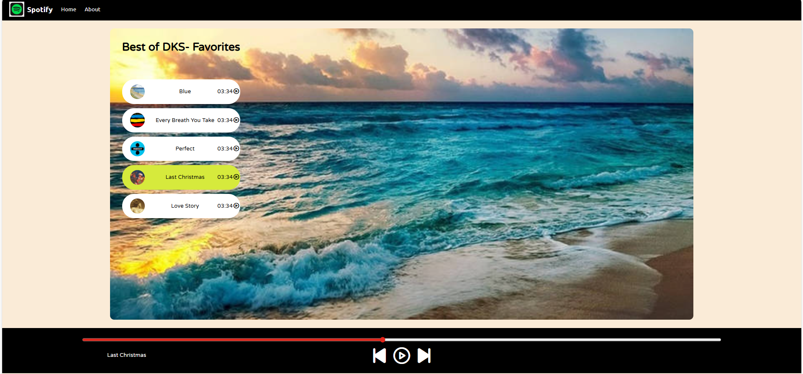
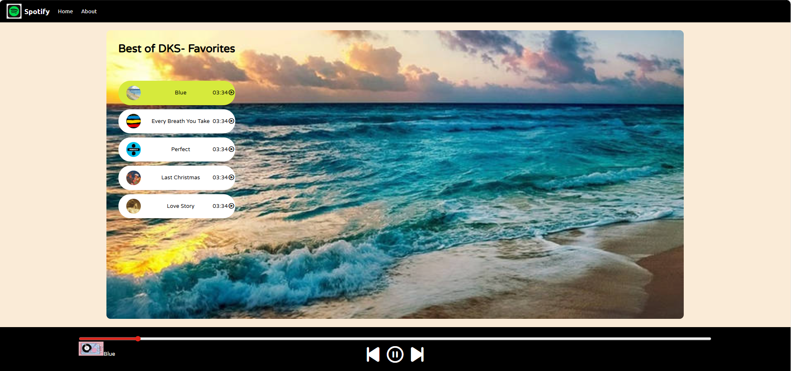

# 🎵 Spotify Clone

A Spotify-inspired music player built using **HTML, CSS, and JavaScript**.

This project was created as part of my frontend learning journey to understand how real-world web applications manage UI state, audio playback, and user interactions.

🔗 **Live Demo:**  
https://devashree-sawant.github.io/spotify-clone/

---

## ✨ Features

- ▶️ Play / ⏸ Pause music
- 🎵 Click songs directly from playlist
- ⏭ Next / ⏮ Previous song controls
- 📊 Progress bar with seek functionality
- 🔁 Auto-play next song
- 🎶 Highlight currently playing song
- 🖼 Background image with dark overlay
- 📱 Clean and responsive UI

---

## 🛠 Tech Stack

- **HTML** – Structure
- **CSS** – Styling & layout
- **JavaScript** – Logic, events, audio control

---

## 📸 Screenshots

### Main Interface


### Playing State


### Playlist Interaction


---
## 🎥 Demo Video

Below is a short demo showcasing the core features of the application:

https://github.com/user-attachments/assets/e2275a3f-e706-43a2-8bb2-c57fecdca573


## 🚀 How to Run Locally

1. Clone the repository  
   ```bash
   git clone https://github.com/devashree-sawant/spotify-clone.git
   
2. Open `index.html` in your browser


